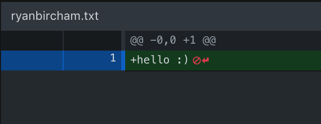

# Learn Github with Ryan!

## Follow these instructions for the live participation section :)

---

## **Getting Ready:**

## 1.0 Fork the main repository

- Navigate to https://github.com/NZMSA/Intro-To-Git
- Click on the Fork button. This creates your own copy of the reporitory on your own Github account.
   

## 1.1 Clone the Repository

- In your own fork repository on github, click on the green "Clone or download" button. Make sure its your own fork, and not the MSA one.
   

- Now you want to click, open in desktop.

## 1.2 If you have mulitple organisations
- In my account, I am linked with different organisations, so I just have to click an extra button here.
   

## **Version Tracking**

## 2. Create a new text file

- Open the repository in your text editor (VsCode) and create a new text file with your name (e.g: ryanbircham.txt).

* Add one line to the text file about your favourite studying snack.

  

## 3. Check the current git stage

- Save the text file and look in github desktop:

- This should show the new file in the staging area or 'changes' area.

  

## 4. Commit your changes

- Down the botom left of github desktop, add a summary such as "added ryanbircham.txt" and press commit.

## 5. Check the status again

- This will show there is no new changes! (Beause the changes got committed!)

## 6. Check the git history

- You can view the history of commits in your branch by clicking history.

## 7. Add another change

- Now that you have created a commit, add a second line to the file you created.
- The second line can be about your favourite colour.
- Save the file.
- Commit the changes to your repo
- Using the history tab, you will be able to see your second commit!

## 8. Add a third line and commit them

- Repeat step 7 and check the git history. 
- The third line can be about your favourite song.
- You should see a third commit you made!
- Congratulations! You have successfully added version control to your new file! The following steps help create a pull request to get these new changes into the remote repostory.

## 9. Now push your changes to the cloud
- Press the push origin button.
- Origin is the remote server (GitHub).

---

## **Collaboration**

## Create a Pull Request

- Navigate to your fork URL (e.g. https://github.com/{yourusername}/Intro-To-Git
- Click on the "New Pull Request" button

- Check the fork you wish to make the pull request from is your personal forked repository master branch

- Click the green "Create pull request" button.
- Congratulations, you have successfully made a Pull Request to the remote repository. Now you will have to wait until the owner of the repository approves and merges your pull request.

## Seeing your changes

- Once your changes have been approved and merged, you can see your changes and other people's changes to the remote repository on https://github.com/NZMSA/Intro-To-Git

- These changes are now MSA's my master branch!